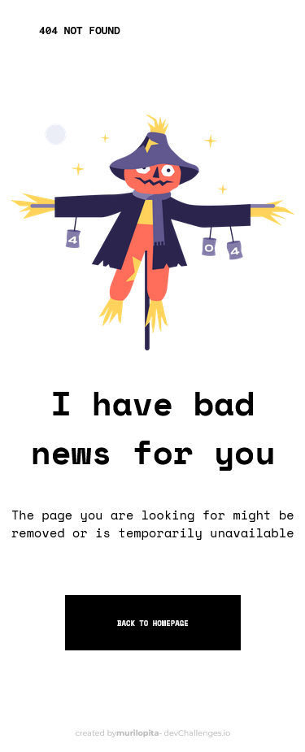

<!-- Please update value in the {}  -->

<h1 align="center">404 not found</h1>

   Solution for a challenge from  <a href="http://devchallenges.io" target="_blank">Devchallenges.io</a>.

  <h3>
    <a href="https://404-not-found-master-eosin.vercel.app/">
      Demo
    </a>
     | 
    <a href="https://devchallenges.io/challenges/wBunSb7FPrIepJZAg0sY">
      Challenge
    </a>
  </h3>

<!-- TABLE OF CONTENTS -->

## Table of Contents

- [Overview](#overview)
- [Built With](#built-with)
- [Features](#features)
- [Contact](#contact)

<!-- OVERVIEW -->

## Overview

<h3 align='center'>Desktop Version</h3>

 
 

<h3 align='center'>Mobile Version</h3>

 
 

## Built With

<!-- This section should list any major frameworks that you built your project using. Here are a few examples.-->

- [HTML](https://developer.mozilla.org/pt-BR/docs/Web/HTML)
- [CSS](https://www.w3.org/Style/CSS/Overview.en.html)

## Features

<!-- List the features of your application or follow the template. Don't share the figma file here :) -->

This application/site was created as a submission to a [DevChallenges](https://devchallenges.io/) challenge. The [challenge](https://devchallenges.io/challenges/wBunSb7FPrIepJZAg0sY) was to build an application to complete the given user stories.

So, for this challenge I used Flexbox to put the "hero image" into the left and all the information error into the right. I made this 404 Not Found Page with "Desktop First" Method.

For Mobile version I used Flexbox too but with "flex direction: Column".

## Contact

- GitHub [@murilopita](https://github.com/murilopita)